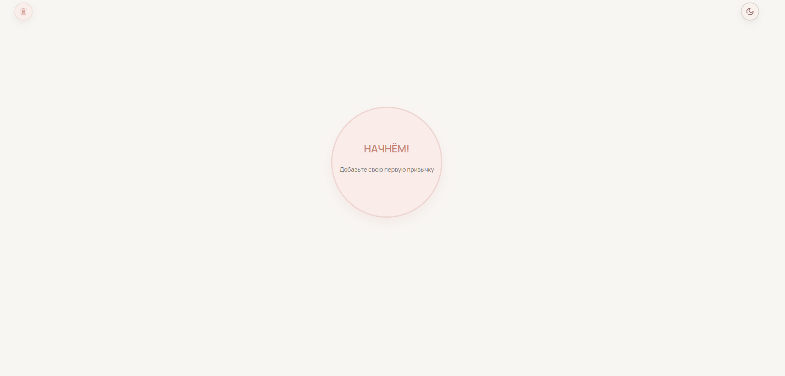
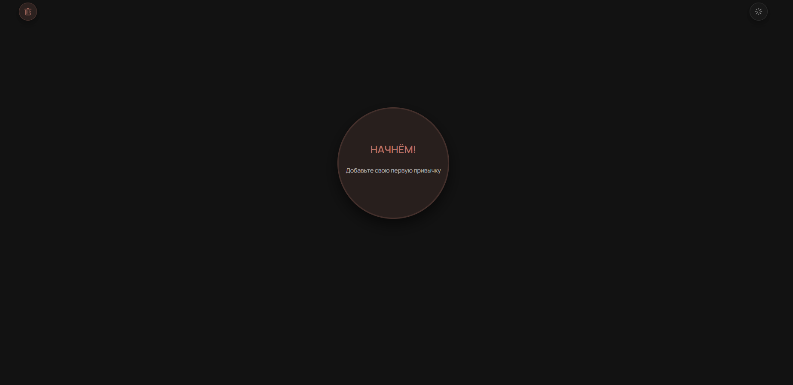
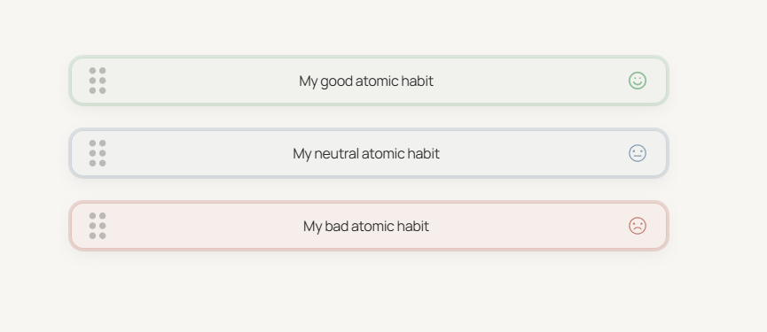

# 🗺 Habit Map

A minimalistic, mobile-first habit tracking app built with modern React architecture and production-level UX patterns.

> Focused on interaction design, mobile edge-cases, and clean component architecture.

## Preview






---

## ✨ Features

- 🌓 Light / Dark theme with persistent storage
- ➕ Create habits above or below any existing item
- ✏️ Inline edit mode (double click / long press on mobile)
- 🎯 3-state rating toggle (plus / neutral / minus)
- 📱 Fully optimized for touch devices
- 🔄 Drag & Drop reordering (dnd-kit)
- 🧠 Mobile-safe gesture handling (pointer capture + safety window)
- 💾 Persistent state via localStorage
- ⚡ Performance-optimized rendering (memoization + stable handlers)

---

## 🛠 Tech Stack

- **React 18**
- **TypeScript**
- **dnd-kit**
- **SCSS (modular structure)**
- **Auto-animate**
- Custom hooks & typed domain logic

---

## 🧱 Architecture Overview

The app follows a clear separation of concerns:

- `App` – top-level orchestration
- `HabitList` – state coordination & DnD context
- `SortableHabitRow` – drag wrapper abstraction
- `HabitRow` – interaction logic
- `RatingToggle` – isolated 3-state controlled component
- `HabitRowControls` – action controls abstraction

State management is handled locally via custom hooks:

- `useHabits`
- `useTheme`

Some UI components are memoized to minimize unnecessary re-renders during drag operations.

---

## 📱 Mobile Interaction Design

Special care was taken to handle touch-specific edge cases:

- `touch-action` handling for drag support
- `pointer capture` to prevent ghost taps
- Safety window to avoid accidental rating changes on activation
- Long-press detection without interfering with drag gestures

---

## ⚡ Performance Considerations

- `React.memo` on row-level components
- Stable handler references to avoid unnecessary re-renders
- Transform-based movement (GPU-accelerated)
- Avoided layout thrashing during drag
- Isolated drag handle to reduce gesture conflicts

---

## 🚀 Getting Started

```bash
npm install
npm run dev
```

## 📌 Future Improvements

- Keyboard reordering UX polish
- Animations refinement
- Accessibility enhancements (ARIA polish)
- Multiselect

## 👨‍💻 Author

Built as a deep dive into:

Mobile interaction design

Drag & Drop systems

React rendering optimization

Gesture conflict resolution

## 🏋️ Challenges & Solutions

### Mobile ghost tap on rating toggle

Solved using pointer capture and a render-synchronous safety window.

### Drag + Long Press conflict

Separated gesture handling using pointer identity tracking and drag-handle isolation.
